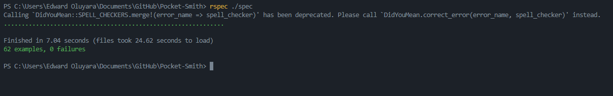

# Pocket-Smith
This is a mobile web application where you can manage your budget whereby you have a list of transactions associated with a category, so that users can see how much money they spent and on what they spent their money on.

## Live Demo
[Pocket Smith](https://pocket-smith.herokuapp.com/)

### Live Presentation
[Pocket Smith App video](https://www.loom.com/share/911d132b31c64383b8fcd39512b839b5)

## Test Cases

## Clone Project
- STEP 1:
  - git clone `git@github.com:oluyaratosin123/Pocket-Smith.git`
- STEP 2:
  - `cd Pocket-Smith` in your terminal
- STEP 3:
  - run `rails server` or `rails s` in your terminal
- STEP 4:
  - visit `localhost:3000` on your browser
> Yeyyy you have the app running **Congratulations** 😅🎉

## Run test suits
  > rspec spec

## Technologies Used
* Language (Ruby on Rails)
* PostgreSQL

## Installation
* Ruby
* Rails
* Postgresql

## 👤 Author 
Edward Yara  
- GitHub: [@oluyaratosin123](https://github.com/oluyaratosin123)
- Twitter: [@TOluyara](https://twitter.com/TOluyara)
- LinkedIn: [LinkedIn](https://www.linkedin.com/in/edward-oluyara/)

## Contributing :handshake:
Contributions, issues, and feature requests are welcome!

## Show your support
Give a :star: if you like this project.

## Acknowledgments
* Original design idea by [Gregoire Vella on Behance](https://www.behance.net/gallery/19759151/Snapscan-iOs-design-and-branding?tracking_source=). Under the [Creative Commons License](https://creativecommons.org/licenses/by-nc/4.0/).

## License :memo:
This project is [MIT](https://github.com/microverseinc/readme-template/blob/master/MIT.md) licensed
